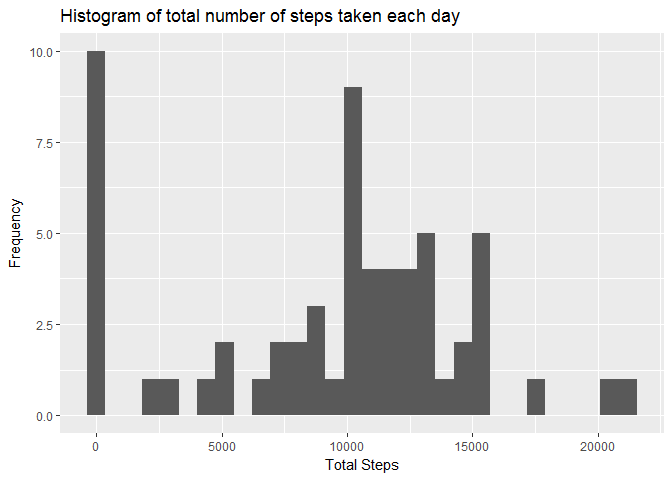
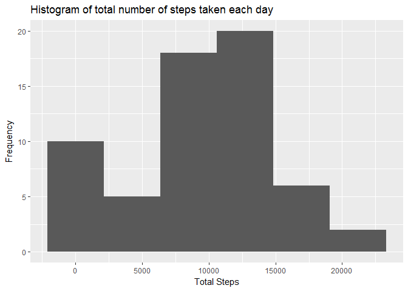
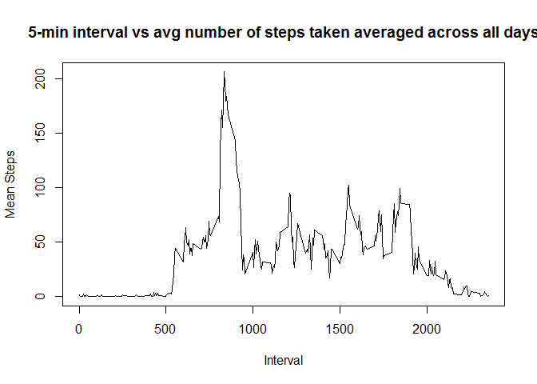
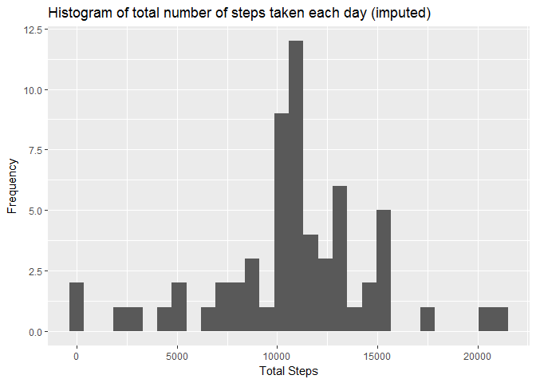
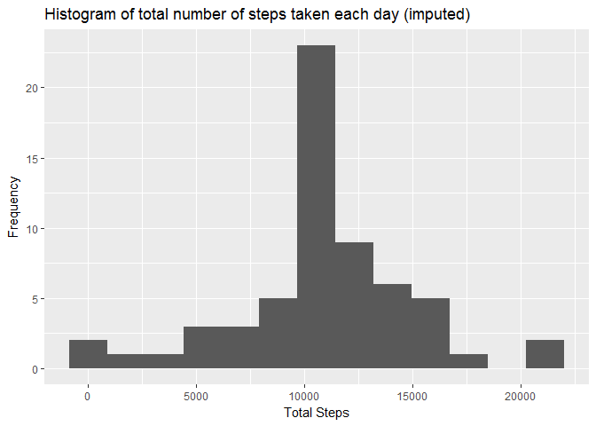
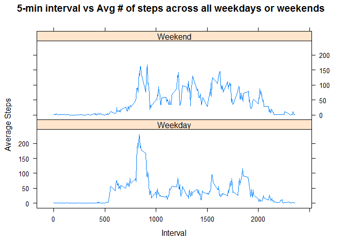

## Introduction

It is now possible to collect a large amount of data about personal movement using activity monitoring devices such as a Fitbit, Nike Fuelband, or Jawbone Up. These type of devices are part of the "quantified self" movement - a group of enthusiasts who take measurements about themselves regularly to improve their health, to find patterns in their behavior, or because they are tech geeks. But these data remain under-utilized both because the raw data are hard to obtain and there is a lack of statistical methods and software for processing and interpreting the data.

This assignment makes use of data from a personal activity monitoring device. This device collects data at 5 minute intervals through out the day. The data consists of two months of data from an anonymous individual collected during the months of October and November, 2012 and include the number of steps taken in 5 minute intervals each day.

## Data

The data for this assignment can be downloaded from the course web site:

Dataset: Activity monitoring data [52K]
The variables included in this dataset are:

steps: Number of steps taking in a 5-minute interval (missing values are coded as NA)
date: The date on which the measurement was taken in YYYY-MM-DD format
interval: Identifier for the 5-minute interval in which measurement was taken
The dataset is stored in a comma-separated-value (CSV) file and there are a total of 17,568 observations in this dataset.


## Assignment

### Part 0 : Environment Setup


```r
# Load in the proper libraries that will be used during this analysis.
library(dplyr)
library(lattice)
library(ggplot2)
```

### Part 1: Loading and preprocessing the data

#### Step 1 : Load the data (i.e. read.csv())

```r
# Download data and extract to get the activity.csv file of interest
url <- "https://d396qusza40orc.cloudfront.net/repdata%2Fdata%2Factivity.zip"
zfile <- "repdata-data-activity.zip"
if(!file.exists(zfile)) {
  download.file(url, zfile, mode = "wb")
}
unzip(zfile)

# Load the data into a data frame
steps <- read.csv("activity.csv", header = T, stringsAsFactors = F)
```
#### Step 2 : Process/transform the data (if necessary) into a format suitable for your analysis

```r
# The date column was read as a "chr" format so transform it into a POSIXct date
steps$date <- as.POSIXct(steps$date, format = "%Y-%m-%d")
```

### Part 2: What is mean total number of steps taken per day?

#### Step 1 : Calculate the total number of steps taken per day

```r
# Using dplyr, group the data by date and then calculate the sum of steps while ignoring NA's
steps_summary <- steps %>% group_by(date) %>% summarize(total_steps = sum(steps, na.rm = TRUE))
```
#### Step 2 : Make a histogram of the total number of steps taken each day.

```r
# Using ggplot2 plot the data in a histogram format
qplot(steps_summary$total_steps, geom = "histogram", xlab = "Total Steps", ylab = "Frequency", main = "Histogram of total number of steps taken each day")
```

```
## `stat_bin()` using `bins = 30`. Pick better value with `binwidth`.
```

<!-- -->

Note the warning message that binwidth is perhaps the wrong choice.  Alternatively, let's adopt the [Freedman-Diaconis](https://en.wikipedia.org/wiki/Freedman-Diaconis_rule) rule for setting binwidth.

```r
# Calculate the number of bins that are optimal
bw <- diff(range(steps_summary$total_steps)) / (2 * IQR(steps_summary$total_steps) / length(steps_summary$total_steps)^(1/3))
# Using ggplot2 plot hte data in histogram format
qplot(steps_summary$total_steps, geom = "histogram", bins = bw, xlab = "Total Steps", ylab = "Frequency", main = "Histogram of total number of steps taken each day")
```

<!-- -->

#### Step 3 : Calculate and report the mean and median of the total number of steps taken per day

```r
# Calculate mean
mean_steps <- mean(steps_summary$total_steps)
mean_steps
```

```
## [1] 9354.23
```

```r
# Calculate median
median_steps <- median(steps_summary$total_steps)
median_steps
```

```
## [1] 10395
```
The mean of the total number of steps per day is **9354.2295082** and the median of the total steps taken per day is **10395**

### Part 3 What is the average daily activity pattern?

#### Step 1 : Make a time series plot of the 5-minute interval (x-axis) and the average number of steps taken, averaged across all days (y-axis)

```r
# First create a table of the means of intervals across all dates
means_summary <- steps %>% group_by(interval) %>% summarize(mean_steps = mean(steps, na.rm = TRUE))
# Plot the means
plot(means_summary$interval, means_summary$mean_steps, type = "l", main = "5-min interval vs avg number of steps taken averaged across all days", xlab = "Interval", ylab = "Mean Steps")
```

<!-- -->

#### Step 2 : Which 5-minute interval on average across all the days in the dataset, contains the maximum number of steps?

```r
# What is the interval of the max of the mean_steps calculation above?
max_mean_interval <- subset(means_summary, mean_steps == max(means_summary$mean_steps))$interval
max_mean_interval
```

```
## [1] 835
```
The interval with the maximum mean across all days is **835**

### Part 4 : Imputing missing values

#### Step 1 : Calculate and report the total number of missing values in the dataset.

```r
colSums(is.na(steps))
```

```
##    steps     date interval 
##     2304        0        0
```

```r
# missing steps, but no missing intervals or date values.  Extract # of missing step values
total_na <- colSums(is.na(steps))[1]
```
There are a total of **2304** missing values in the dataset

#### Step 2 : Devise a strategy for filling in all of the missing values in the dataset.  The strategy does not need to be sophisticated.  For example, you could use the mean/median for that day, or the mean for that 5-minute interval, etc.

```r
# Adoptive strategy is to just replace the NA values with the mean for that 5-min interval
# So merge the mean_summary to the steps data frame to get the means in the same df
steps2 <- merge(steps, means_summary, by = "interval")
```

#### Step 3 : Create a new dataset that is equal to the original datset but with the missing data filled in

```r
# First we need to convert the integer column steps to a numeric steps
steps2$steps <- as.numeric(steps2$steps)
# Finalize new data frame to contain the data without the NAs
steps2$steps[is.na(steps2$steps)] <- steps2$mean_steps[is.na(steps2$steps)]
```
#### Step 4 : Make a histogram of the total number of steps taken each day and Calculate and report the mean and median total number of steps taken per day.  Do these values differ from the estimates from the first part of the assignment?  What is the impact of imputing missing data on the estimates of the total daily number of steps?

```r
# New histogram, and new mean/median calculations to compare with previously.  This time without rm.na = TRUE
steps_summary2 <- steps2 %>% group_by(date) %>% summarize(total_steps = sum(steps))
# Using ggplot2 plot the data in a histogram format
qplot(steps_summary2$total_steps, geom = "histogram", main ="Histogram of total number of steps taken each day (imputed)", xlab = "Total Steps", ylab = "Frequency")
```

```
## `stat_bin()` using `bins = 30`. Pick better value with `binwidth`.
```

<!-- -->

```r
#Again binwidth is a little off so let's recalculate and replot
bw2 <- diff(range(steps_summary2$total_steps)) / (2 * IQR(steps_summary2$total_steps) / length(steps_summary2$total_steps)^(1/3))
# Using ggplot2 plot hte data in histogram format
qplot(steps_summary2$total_steps, geom = "histogram", bins = bw2, main ="Histogram of total number of steps taken each day (imputed)", xlab = "Total Steps", ylab = "Frequency")
```

<!-- -->

```r
# Find the mean and median calculations
# Calculate mean
mean_steps2 <- mean(steps_summary2$total_steps)
mean_steps2
```

```
## [1] 10766.19
```

```r
# Calculate median
median_steps2 <- median(steps_summary2$total_steps)
median_steps2
```

```
## [1] 10766.19
```
The new mean is **10766.1886792453** compared to **9354.2295082** originally, and the new median is **10766.1886792453** compared to **10395** originally.  Clearly there is a big impact on whether or not to use the means as the replacement for missing data.  In fact, it now looks like the median is one of the replacement values which is no longer an integer.  The impact is the mean has now increased and the median has decreased.

### Part 5 : Are there differences in activity patterns between weekdays and weekends?

#### Step 1 : Create a new factor variable in the dataset with two levels - "weekday" and "weekend" indicating whether a given date is a weekday or weekend day.


```r
# Using the suggested weekdays() function, find out the days of the date column.
steps2$day <- weekdays(steps2$date)
# Now that we have the day in the day column, find the day type (weekend/weekday).  Make sure this is a factor as specified in the instructions.
steps2$daytype <- as.factor(ifelse(steps2$day == "Saturday" | steps2$day == "Sunday", "Weekend", "Weekday"))
```

#### Step 2 : Make a panel plot containing a time series plot of the 5 minute interval (x-axis) and the average number of steps taken, averaged across all weekday days or weekend days (y-axis).

```r
# Summarize the data so we can plot
means_by_daytype <- steps2 %>% group_by(interval, daytype) %>% summarize(total_means = mean(steps))
# From the lattice package use the xyplot to plot the requested time series
xyplot(total_means ~ interval | daytype, means_by_daytype, layout=c(1,2), type = "l", main = "5-min interval vs Avg # of steps across all weekdays or weekends", xlab = "Interval", ylab = "Average Steps")
```

<!-- -->

## Conclusions

The data seem to support peaks in activity around the 835 5-min time interval which would be around morning time.  Breaking this down by weekday/weekend designation we tend to see that the peak at 835 is generally smaller on the weekends, but there is greater steps taken throughout the day suggesting people don't have a set time for when they take their steps on the weekend.
